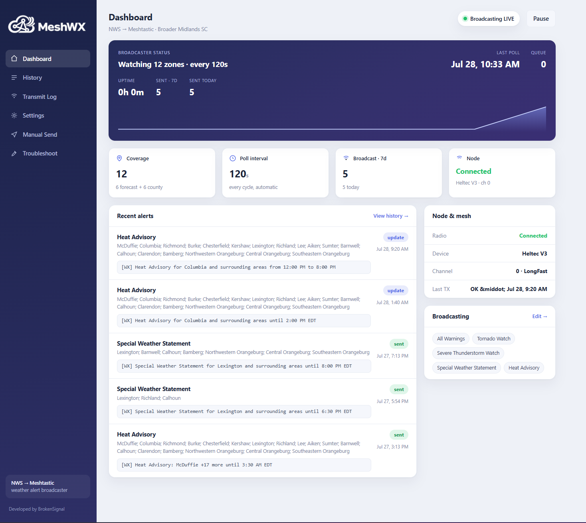

<h1 align="center">MeshWX</h1>

<p align="center">
  <b>Off-grid weather warnings.</b> MeshWX watches the National Weather Service and
  broadcasts the alerts that matter over your <a href="https://meshtastic.org/">Meshtastic</a>
  and/or <a href="https://meshcore.co.uk/">MeshCore</a> radios, so your mesh keeps getting
  tornado, flood, and severe-storm warnings when the cell network and internet are gone.
</p>

<p align="center">
  Self-hosted · one small web app · runs on a Raspberry Pi, a Windows PC, or Docker · no account, no cloud.
</p>

<p align="center">
  <b>Status: Beta (v0.1.0).</b> Tested on a Heltec V3 and a Seeed Tracker T1000-E.
</p>

---

<p align="center">
  
</p>

> [!NOTE]
> **MeshWX is in beta and under active testing.** It has been verified on a **Heltec V3** and a **Seeed Tracker T1000-E**. Other Meshtastic and MeshCore
> compatible boards should work but are not tested yet, so expect rough edges. Please report
> what does and does not work via [Issues](../../issues).

> [!WARNING]
> **MeshWX is a supplemental tool, not a certified warning system.** It depends on your
> internet connection to reach the NWS API, on your hardware, and on LoRa propagation.
> Do **not** rely on it as your only source of life-safety alerts. Always keep an
> official channel: a NOAA Weather Radio, wireless emergency alerts, or local sirens.
> Test it in **dry-run mode** before you trust it, and review the settings for your area.

## Why it exists

When a hurricane or flood takes out the towers, a LoRa mesh often keeps working, but the
mesh has no way to *know* a warning was issued. MeshWX bridges that gap: it polls the
[NWS alerts API](https://www.weather.gov/documentation/services-web-api), decides what's
worth sending, formats it to fit a LoRa packet, and transmits it to everyone on your
channel. Built after living through Hurricane Helene's comms blackout.

## Features

- **Dual radio, side by side.** Run Meshtastic, MeshCore, or **both at once**: every
  alert goes to each enabled radio on its own channel.
- **Dead-simple setup.** Pick your state and check your counties; the NWS zones populate
  automatically. Choose which alerts to send from checklists, not cryptic codes to type.
- **Smart filtering.** Broadcast all Warnings plus Tornado Watch by default; add other
  Watches/Advisories à la carte.
- **No spam.** Never rebroadcasts the same alert; sends one concise *update* when a warning
  materially changes and a *cancellation* when it clears. Old state auto-expires.
- **Fits a LoRa packet.** Alerts are trimmed to ≤195 bytes, e.g.
  `[WX] Tornado Warning: Charleston +2 more until 8:45 PM EDT`.
- **Dry-run by default.** Automated alerts are logged, not transmitted, until you flip it on.
- **A real dashboard.** Live radio status, recent alerts, 7-day activity, transmit log,
  and a per-radio **Send test** button to key up each radio on the bench.

## Install

Pick the one that matches your box. All three run the exact same app.

### 🐳 Docker (any Linux host, incl. 64-bit Raspberry Pi)

```bash
docker run -d --name meshwx \
  -p 8110:8000 \
  -v meshwx-data:/data \
  --device-cgroup-rule='c 188:* rmw' \
  --device-cgroup-rule='c 166:* rmw' \
  -v /dev:/dev \
  --restart unless-stopped \
  ghcr.io/brokensignal/meshwx:latest
```

Or clone the repo and `docker compose up -d`. Then open `http://<host>:8110`.
The `--device` rules + `/dev` mount let the container reach any USB serial radio without
pinning a device path (they renumber on replug). See the compose file for details.

### 🥧 Raspberry Pi / Linux (native, no Docker)

64-bit Raspberry Pi OS (or any Debian/Ubuntu). Plug in your radio, then:

```bash
git clone https://github.com/BrokenSignal/MeshWX.git
cd MeshWX
sudo ./packaging/install-linux.sh
```

This creates a virtualenv, adds you to the `dialout` group for serial access, and installs
a `systemd` service that starts on boot. Opens on `http://<pi>:8110`.
Manage with `sudo systemctl restart mesh-wx` and `journalctl -u mesh-wx -f`.

### 🪟 Windows

1. Download `MeshWX-windows-*.zip` from the [Releases](../../releases) page.
2. Unzip anywhere and run **MeshWX.exe**.
3. Your browser opens to the dashboard automatically. Keep the console window open;
   close it to stop MeshWX.

No Python install required. Windows may warn about an unrecognized app the first time:
"More info → Run anyway" (the build is unsigned).

## First run

1. Open the dashboard, go to **Settings**.
2. **General → NWS contact**: set this to your email address. The NWS API
   [requires a contact string](https://www.weather.gov/documentation/services-web-api)
   in every request; leaving the default placeholder can get you rate-limited or blocked.
3. **Coverage**: pick your state, check your counties.
4. **What to broadcast**: leave *All Warnings* on; add any watches/advisories you want.
5. **Radios**: enable Meshtastic and/or MeshCore and set each one's USB serial port and channel.
6. Save, then go to **Troubleshoot → Send test** to confirm each radio actually transmits.
7. When you're confident, turn **dry-run off** on the dashboard to go live.

### Radio notes

- **Meshtastic**: any Meshtastic device on USB serial. The board can renumber its serial
  port on replug; leave the port blank to auto-discover, or set it.
- **MeshCore**: flash the board with the **USB (companion)** firmware, *not* repeater
  firmware. Repeater firmware exposes no serial API, so MeshWX can't drive it.
- **Tested hardware.** So far MeshWX is verified on a Heltec V3 and a Seeed
  Tracker T1000-E. Other compatible boards should work; if you run one, please
  open an [issue](../../issues) and let me know how it went.

### Channels: live vs. test

MeshWX keeps testing off the air people are actually watching:

- **Channel 0 is the live channel**: real NWS alerts broadcast there (each radio's
  alert channel, index 0 by default).
- **Channel 1 is the test channel**: the per-radio **Test** buttons and the manual-send
  page transmit there, so testing never clutters the live alert channel.

Both are set in **Settings** (per-radio alert channel, plus a global **Test channel**).
Point your listening node at channel 0 for real alerts, or channel 1 to watch tests.

### Repeat sends

LoRa channel broadcasts have no acknowledgement, so a single packet can be dropped. Each
radio can send every alert more than once (**Repeat each alert**, default 2), spaced a few
seconds apart, so one lost packet doesn't mean a missed warning. Set per radio in Settings.

## Configuration

Only three settings come from the environment (needed to boot). Everything else lives in
the UI and the database.

| Env var        | Default (native)                         | Purpose            |
| -------------- | ---------------------------------------- | ------------------ |
| `MESH_WX_PORT` | `8000` (`8110` for the systemd service)  | HTTP port          |
| `MESH_WX_HOST` | `0.0.0.0`                                | HTTP bind address  |
| `MESH_WX_DB`   | per-OS data dir (see below)              | SQLite file path   |

The default database location when `MESH_WX_DB` is unset:
`/data` in Docker · `%LOCALAPPDATA%\MeshWX` on Windows ·
`~/Library/Application Support/MeshWX` on macOS · `~/.local/share/mesh-wx` on Linux.

## Development

```bash
python -m venv .venv && . .venv/bin/activate
pip install -r requirements-dev.txt
pytest                 # unit tests (filter / formatter / dedupe / poller)
python -m app.main     # http://localhost:8000
```

Stack: FastAPI + Uvicorn, server-rendered Jinja templates + htmx, SQLite. No build step.
The filter, formatter (byte-cap), and dedupe logic are covered by unit tests backed by
captured NWS alert JSON fixtures under `tests/fixtures/`, with no serial/network deps.

## Credits

Thanks to the people helping make MeshWX real:

- **Matthew Crook (W1MRC)**: testing and outreach.

More hands are welcome. If you test MeshWX, help spread the word, or run it on your own
mesh, open an [issue](../../issues) or pull request and you'll be added here.

## License

[MIT](LICENSE). Free to use, modify, and share. Contributions welcome.

## Keep it running when the grid goes down

MeshWX only helps if it is still up when the weather turns bad, which is exactly
when grid power and internet tend to fail. The mesh side keeps relaying on its own,
but MeshWX itself needs two things to *know* an alert was issued and push it out:
power, and a path to the National Weather Service. Plan for both.

- **Power: run it on battery, solar, or a UPS.** A Raspberry Pi and a LoRa radio
  draw very little, so a small solar panel with a battery, or even a modest UPS, can
  keep MeshWX broadcasting for hours or days after the power drops. Put your listening
  nodes on backup power too, since a warning nobody's radio can receive helps no one.
- **Internet: use a resilient link like Starlink.** MeshWX polls the NWS over the
  internet, so if your cable or fiber dies with the grid, it goes quiet. A satellite
  link such as Starlink, on its own battery or solar, keeps alerts flowing when
  terrestrial service is down.
- **Know the limit.** With no internet and no backup path, MeshWX cannot fetch new
  alerts. It is a bridge from the NWS to your mesh, not a weather source of its own.
  Keep a NOAA Weather Radio as the offline fallback.

<p align="center"><sub>Developed by <a href="https://BrokenSignal.tv/MeshWX">BrokenSignal</a></sub></p>
